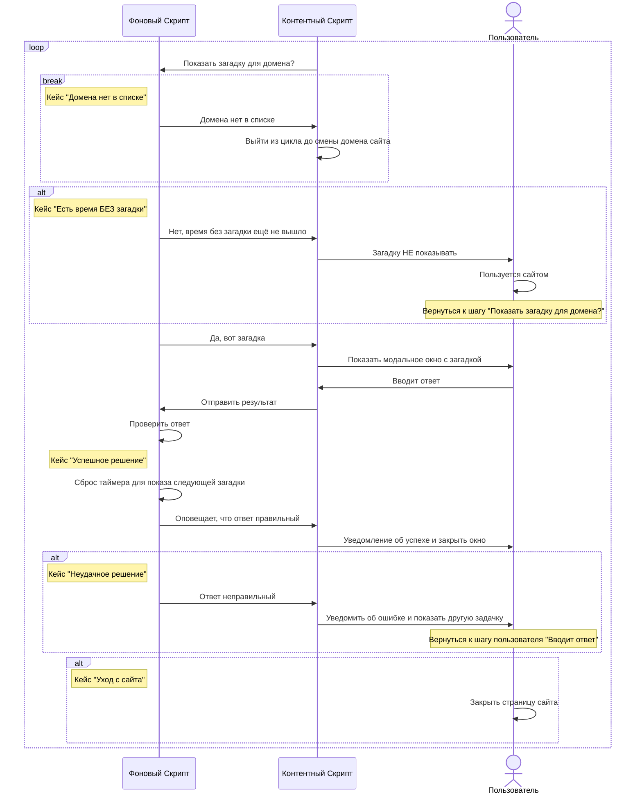

# Блокировка загадкой

Это расширение помогает вернуть контроль над вниманием. После определённого времени на сайте появляется загадка. Реши её, чтобы продолжить, или покинь сайт. Простое и эффективное средство для сосредоточения, особенно на отвлекающих сайтах.

# Riddle Lock

This extension helps you regain control of your attention. After spending a certain amount of time on a website, a riddle appears. Solve it to continue using the site or leave. A simple and effective tool for staying focused, especially on distracting websites.

---

## Диаграмма последовательностей

