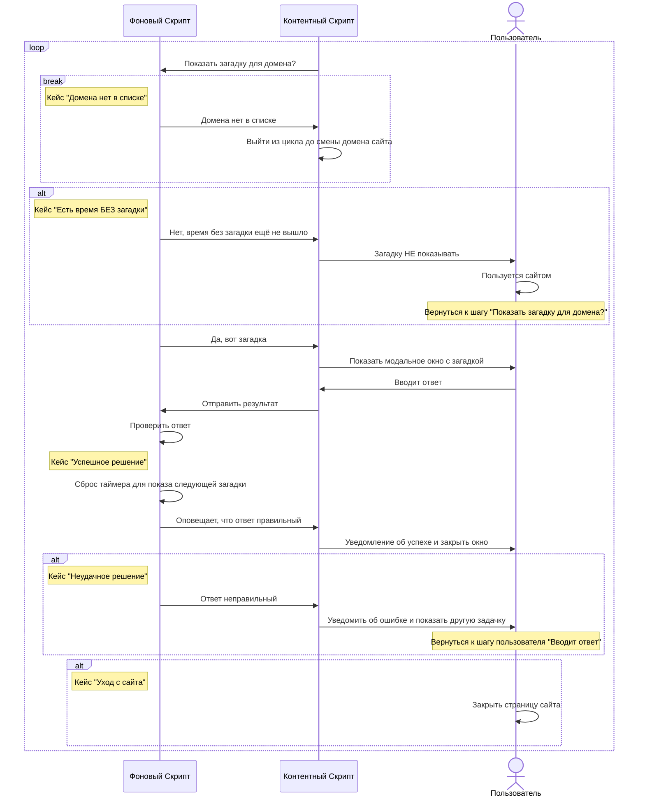

# Riddle Lock 🔒🤔

## **Блокировка с загадками для продуктивности**

**Riddle Lock** помогает контролировать ваше внимание на отвлекающих сайтах. Когда вы проводите определённое время на сайте, появляется загадка. Решите её, чтобы продолжить, или закройте сайт и вернитесь к делам. Простое и эффективное средство для повышения концентрации!

### 🛠️ **Фичи:**

- **🎯 Блокировка по части URL**  
  Блокируйте конкретные разделы сайта, например, `https://www.youtube.com/shorts`, оставляя остальной сайт доступным.

- **🧩 Загадки для доступа**  
  Чтобы продолжить пользоваться сайтом, нужно решить загадку.

- **⏱️ Настройка времени без загадок**  
  Установите, сколько времени сайт будет доступен после правильного ответа.

## **Riddle-Based Blocking for Productivity**

**Riddle Lock** helps you regain control of your attention on distracting websites. After spending a certain amount of time on a site, a riddle appears. Solve it to continue, or leave the site and refocus. A simple and effective tool to boost your concentration!

---

### 🛠️ **Features:**

- **🎯 URL Path-Based Blocking**  
  Block specific sections of a website, like `https://www.youtube.com/shorts`, without blocking the entire site.

- **🧩 Riddles for Access**  
  Solve a riddle to keep using the site.

- **⏱️ Set Time Without Riddles**  
  Configure how long the site remains accessible after solving a riddle correctly.

---

## TODO:
- Создавать свои собственные загадки
- Сделать настройку чтобы показывать правильный ответ
## Диаграмма последовательностей

